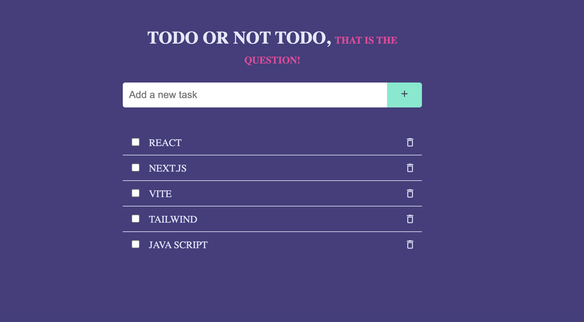

# React ToDo App

The ToDoList App is a digital organizer designed to simplify task management and enhance productivity for users. It provides a convenient platform for creating, managing, and organizing to-do lists, helping users streamline their tasks and stay organized with their daily activities.

## Features

**Create Tasks:** Easily create new tasks for different projects or categories.
**Edit and Delete:** Edit or delete tasks as needed to keep your lists up to date.
**Checklist:** Mark off completed tasks with a checklist feature.

## Screenshot

